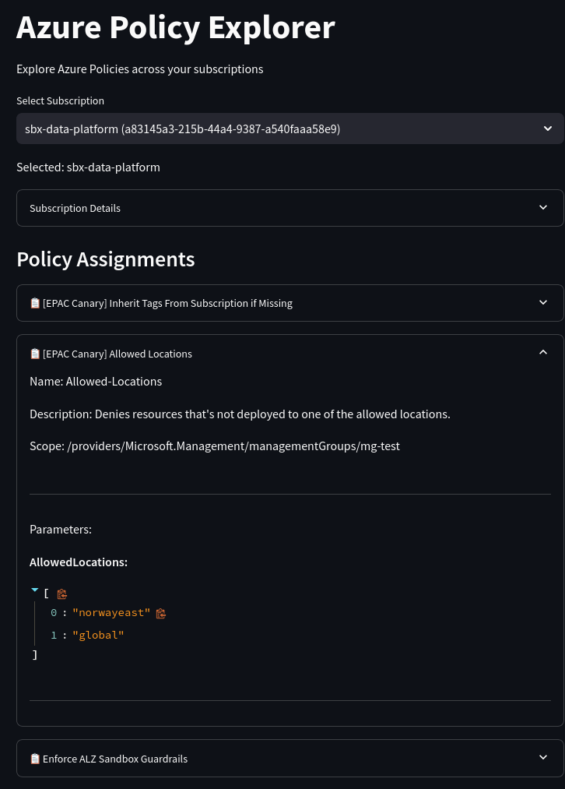

# Azure Policy Explorer

A streamlit application that helps you explore Azure Policies across your subscriptions. The application provides a simple web interface to:
- View all your Azure subscriptions
- List policy assignments for each subscription
- Display detailed policy information including parameters

Screenshot:

<kbd></kbd>

## Prerequisites

- Python 3.x
- Azure CLI installed and logged in (`az login`)
- Active Azure subscription

## Installation

1. Install required packages:
```bash
pip install streamlit azure-identity azure-mgmt-subscription azure-mgmt-resource
```

2. Log in to Azure:
```bash
az login
```

## Running the Application

Run the application using:
```bash
streamlit run app.py
```

The application will open in your default web browser. If it doesn't open automatically, navigate to the URL shown in the terminal (typically http://localhost:8501).

## Features

- Simple subscription selection via dropdown menu
- Detailed view of subscription information
- List of all policy assignments with:
  - Policy names and descriptions
  - Enforcement mode
  - Scope
  - Parameter values and settings

## Troubleshooting

If you encounter authentication errors:
1. Ensure you're logged in to Azure CLI (`az login`)
2. Verify you have the necessary permissions to view policies
3. Check that your Azure credentials are properly configured
